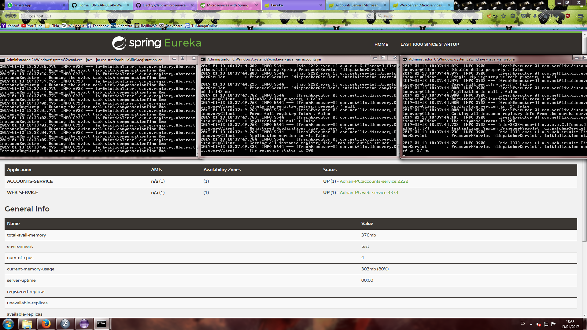
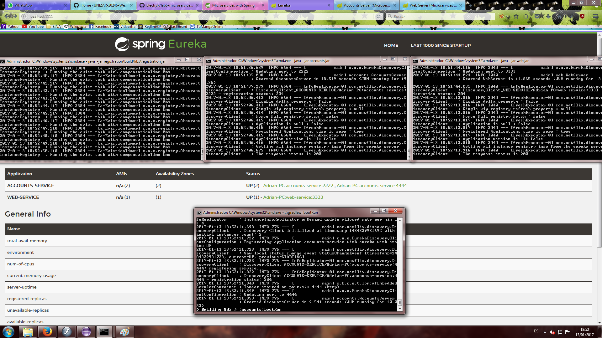

- Two microservices running:
  

- A third accounts microservice added at port 4444:
  

- Why the web microservice still running correctry when 1st accounts microservice is dead?

    Because microservices registers itselfs with a server name, and a second ACCOUNTS-SERVICE is alive.
    Then, is this microservice that receives requests from web microservice.